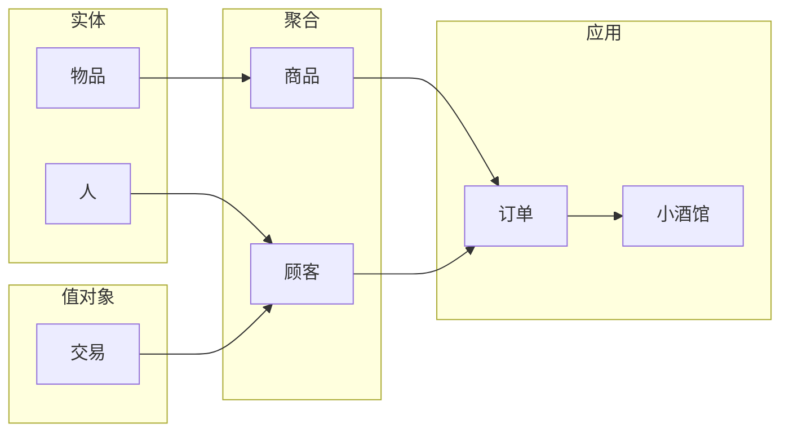

# 小酒馆的DDD实践

> 参考资料：
> 1. [How To Implement Domain-Driven Design (DDD) in Golang](https://programmingpercy.tech/blog/how-to-domain-driven-design-ddd-golang/)
> 2. [Github Code](https://github.com/percybolmer/ddd-go)

## 定义

`实体`：具有唯一标识的对象，可变的

`值对象`：没有唯一标识的对象，不可变。比如一单交易执行了，它就不能改变状态了

`聚合`：实体和值对象的组合集，存储在存储库

## 设计

## 实现

实现过程：`domain --> infrastructure --> application --> interface`

### domain
实现顺序：`实体 --> 值对象 --> 聚合`

### infrastructure
在`domain`中定义 `repository` 接口，然后在`infrastructure`中实现这些接口

## 总结
能够把基本流程走一遍，但依然有这几个问题：
1. insfrastructure中的实现,现在还是比较单一的，理论上能抽象下
2. 这个结构还是需要优化的，还是比较别扭的
3. trasaction也没有被使用到