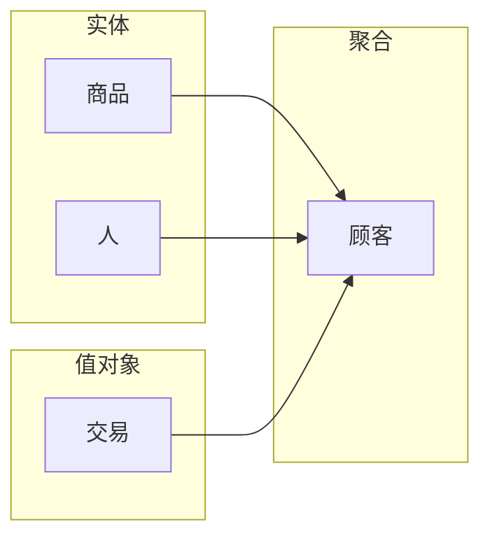

# 小酒馆的DDD实践

> 参考资料：
> 1. [How To Implement Domain-Driven Design (DDD) in Golang](https://programmingpercy.tech/blog/how-to-domain-driven-design-ddd-golang/)
> 2. [Github Code](https://github.com/percybolmer/ddd-go)

## 定义

`实体`：具有唯一标识的对象，可变的

`值对象`：没有唯一标识的对象，不可变。比如一单交易执行，它就不能改变状态了

`聚合`：由一组相关的实体和值对象组成的集合，它们之间是有关联的，它们之间的关联是有规律的，它们之间的关联是有方向的。

`聚合根`：聚合的入口，它是聚合的唯一标识，它是聚合

## 设计

## 实现

实现过程：`domain --> infrastructure --> application --> interface`

### domain
实现顺序：`实体 --> 值对象 --> 聚合`

### infrastructure
在`domain`中定义 `repository` 接口，然后在`infrastructure`中实现这些接口